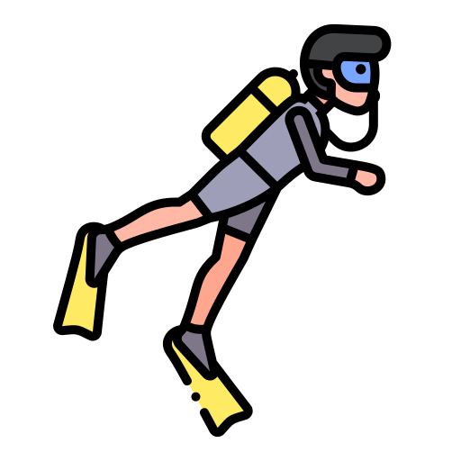

  <h1> Hello World ✌️👻</h1>

  

  
  
  
  

## About Me 👨‍💻 🤖

- **Graduated from** Sabancı University, Computer Science & Engineering
  - Minor in Math
  - Double Major in Economics

- Interested in
    - **Software Engineering**
        - Backend Development
        - Distributed Algorithms
        - DevOps Engineering
    - **Artificial Intelligence**
        - Combinatorial Problems
        - Logical Reasoning
        - Constraint Satisfaction

- I love Scuba Diving & Trekking

- My website: <https://giraycoskun.dev>
- My Github Projects: <https://giraycoskun.github.io/>

## My Socials

  
  
  
  

## My Skills

## Projects

### Personal Projects

- automated-reasoning
- transporter
- tvtime-scrapy-api
- f1-dashboard
- music-library
- University Anouncement System

### School Projects

- Encryption in Assembly
- Client-Server-Drive-App
- yumyum-social-network

### Research Projects

- Answer Set Programming in Kidney Exchange PRoblem

- Using Unified Combinatorial Interaction Testing for MC/DC Coverage

- A Combinatorial Interaction Testing-Based Daily Build Process

- Unsupervised SSVEP Signal Classification

- KANADE RUSSELL’S Identity Finder

---

    

